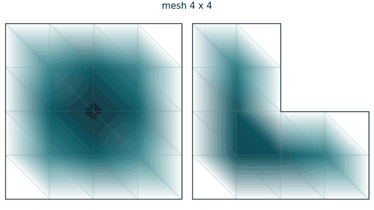
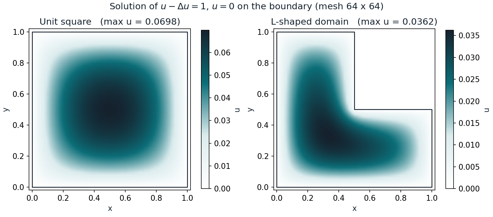
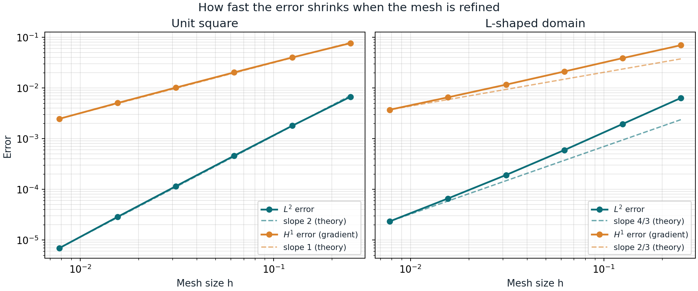

# Finite elements in 2D, built from scratch

A finite element solver for the reaction–diffusion problem

$$u - \Delta u = 1 \quad \text{in } \Omega, \qquad u = 0 \quad \text{on } \partial\Omega,$$

with linear (P1) triangular elements, on two domains: the **unit square** and
the **L-shaped domain** (the unit square without its top-right quarter). The
code is written with NumPy and SciPy only, without a finite element library,
and the error is measured against an exact solution.



## Background

This was an implementation assignment in the course *Partial Differential
Equations and the Finite Element Method* at Karlstad University, Sweden
(report dated 6 February 2024). The task was to assemble the finite element
matrices by hand, solve the problem on the unit square and on an L-shaped
domain, and compare with the FEniCS library.

The original 2024 work is kept in [`original-2024/`](original-2024). This
repository adds a revised 2026 version in [`modified-2026/`](modified-2026);
see [What changed since 2024](#what-changed-since-2024).

## The method

Multiplying the equation by a test function $v$ that vanishes on the boundary
and integrating by parts gives the weak form: find $u$ with $u = 0$ on
$\partial\Omega$ such that

$$\int_\Omega u\,v \,dx + \int_\Omega \nabla u \cdot \nabla v \,dx = \int_\Omega v \,dx \quad \text{for all such } v.$$

Writing $u = \sum_j u_j \varphi_j$ in the piecewise linear "hat" functions
$\varphi_j$ of a triangle mesh turns this into a linear system

$$(M + K)\,\mathbf{u} = \mathbf{b}, \qquad
M_{ij} = \int_\Omega \varphi_i \varphi_j, \quad
K_{ij} = \int_\Omega \nabla\varphi_i \cdot \nabla\varphi_j, \quad
b_i = \int_\Omega \varphi_i .$$

The 2026 code builds $M$, $K$ and $\mathbf{b}$ the standard way: it loops over
the triangles, computes a small $3 \times 3$ matrix for each one, and adds it
into the large sparse matrices. On a triangle with area $|T|$:

- mass: $\int_T \varphi_i \varphi_j = \frac{|T|}{12}$, or $\frac{|T|}{6}$ when $i = j$,
- stiffness: $\int_T \nabla\varphi_i \cdot \nabla\varphi_j = |T|\, g_i \cdot g_j$, where the gradients $g_i$ are constant on the triangle,
- load: $\int_T \varphi_i = \frac{|T|}{3}$.

The meshes are uniform: $n \times n$ square cells, each cut into two
triangles along the diagonal from top-left to bottom-right, as in the 2024
report. For the L-shape, $n$ is even, so the corner $(0.5, 0.5)$ is a node.

## Results



**Measuring the error.** On the square, the exact solution is known as a
Fourier series:

$$u(x, y) = \sum_{m,\,n \text{ odd}} \frac{16}{\pi^2 m n \left(1 + \pi^2 (m^2 + n^2)\right)} \sin(m\pi x)\,\sin(n\pi y),$$

which gives $u(0.5, 0.5) = 0.06981$. On the L-shape there is no formula, so a
solution on a very fine mesh ($n = 1024$) is used as the reference. Two error
measures are reported: the $L^2$ error (the size of $u - u_h$) and the $H^1$
error (the size of $\nabla u - \nabla u_h$).



| Mesh $n$ | Square, $L^2$ | rate | Square, $H^1$ | rate | L-shape, $L^2$ | rate | L-shape, $H^1$ | rate |
|---:|---:|---:|---:|---:|---:|---:|---:|---:|
| 4   | 6.7e-3 |      | 7.7e-2 |      | 6.3e-3 |      | 7.0e-2 |      |
| 8   | 1.8e-3 | 1.90 | 4.0e-2 | 0.94 | 1.9e-3 | 1.70 | 3.9e-2 | 0.84 |
| 16  | 4.6e-4 | 1.97 | 2.0e-2 | 0.98 | 5.9e-4 | 1.71 | 2.1e-2 | 0.87 |
| 32  | 1.2e-4 | 1.99 | 1.0e-2 | 1.00 | 1.9e-4 | 1.63 | 1.2e-2 | 0.86 |
| 64  | 2.9e-5 | 2.01 | 5.0e-3 | 1.01 | 6.6e-5 | 1.54 | 6.5e-3 | 0.83 |
| 128 | 6.9e-6 | 2.05 | 2.5e-3 | 1.03 | 2.3e-5 | 1.50 | 3.7e-3 | 0.81 |

The *rate* is how many times smaller the error gets, as a power of 2, when the
mesh is refined once: rate 2 means the error drops by a factor of 4.

**On the square,** the error behaves exactly as the theory for linear elements
predicts: the $L^2$ error falls like $h^2$ and the $H^1$ error like $h$.

**On the L-shape,** convergence is slower, and the rates keep falling as the
mesh is refined. The reason is the re-entrant corner at $(0.5, 0.5)$, where
the domain has an interior angle of $3\pi/2$. Near such a corner the exact
solution behaves like $r^{2/3}\sin(2\theta/3)$, where $r$ is the distance to
the corner, so its gradient becomes infinite there. Linear elements on a
uniform mesh cannot resolve this, and in the limit the rates drop to $4/3$
($L^2$) and $2/3$ ($H^1$). The measured rates are still on their way down
towards these values. This is why the L-shape is a classic test problem, and
why practical codes refine the mesh near corners.

## What changed since 2024

The 2024 code is kept in [`original-2024/`](original-2024): the hand-built
solvers for the square and the L-shape (rebuilt from the report's appendix)
and the three FEniCS scripts. Running
[`compare_2024.py`](modified-2026/compare_2024.py) runs the 2024 assembly and
compares it with the 2026 solver.

1. **The 2024 square solver was already correct.** In 2024, every piece of
   the method was built by hand: each hat function, its slope, and where each
   number goes in the big matrix. The 2026 solver does the same job the
   standard way. On the unit square, both give the same answers to about 16
   decimal places (differences around $10^{-16}$), so the 2024 work was right;
   the 2026 version is simply shorter.
2. **A bug in the 2024 L-shape solver is fixed.** To make the L-shape, the
   2024 code "switched off" the points in the cut-out corner but did not
   remove them from the system of equations. These leftover points got
   nonsense values, around 1, while the real solution never goes above 0.04.
   Because they were still connected to their neighbours (through the mass
   matrix), they pulled the nearby values slightly wrong: off by 6% on a
   coarse mesh ($N = 7$) and 2% on a finer one ($N = 15$). With the leftover
   points removed, the 2024 code gives exactly the 2026 answer. There was
   also a smaller issue: for some mesh sizes (even $N$, as used in the
   report), the cut-out corner was not exactly at 0.5 but slightly off, for
   example at $9/17 \approx 0.53$ for $N = 16$.
3. **The error is now measured properly.** The 2024 "error" plot compared
   the solution with zero instead of with the true answer
   (`errornorm(u_D, u)` with $u_D = 0$). So it measured how big the solution
   is ($\|u_h\|_{L^2} \approx 0.039$), not how wrong it is. In 2026, the
   square is compared with the exact answer, written as an infinite sum (the
   Fourier series above). The L-shape has no exact formula, so it is compared
   with a solution on a very fine mesh. This shows how fast the error shrinks
   when the mesh gets finer.
4. **The code is shorter and more flexible.** The 2026 code goes through the
   triangles one at a time and adds each triangle's small contribution to the
   big matrix, which is how all finite element software works
   (element-by-element assembly). This replaces about 300 lines of
   special-case index bookkeeping, works for any shape made of triangles, and
   is fast: a $128 \times 128$ mesh takes about 0.2 seconds.

## Repository structure

```
finite-elements-2d/
├── README.md
├── LICENSE
├── requirements.txt
├── figures/                  figures used in this README
├── modified-2026/
│   ├── fem.py                meshes, assembly and solver
│   ├── exact.py              exact series solution on the square
│   ├── convergence.py        error study on both domains
│   ├── figures.py            figures and animation
│   ├── compare_2024.py       runs the 2024 code and compares
│   └── run_all.py            runs the error study and the figures
└── original-2024/
    ├── report-2024.pdf       the original report
    ├── manual_square.py      hand-built solver, unit square
    ├── manual_lshape.py      hand-built solver, L-shaped domain
    ├── fenics_square.py      FEniCS, unit square
    ├── fenics_lshape.py      FEniCS, L-shaped domain
    └── fenics_error.py       FEniCS, the 2024 "error" study
```

The FEniCS scripts need the legacy FEniCS library (`dolfin`), which is not
needed for anything in `modified-2026/`.

## How to run

You need Python 3 with NumPy, SciPy, Matplotlib and Pillow (and SymPy, only
for `compare_2024.py`).

```bash
pip install -r requirements.txt
python modified-2026/run_all.py        # error study and figures, about a minute
python modified-2026/compare_2024.py   # comparison with the 2024 code
```

## References

1. C. Johnson, *Numerical Solution of Partial Differential Equations by the
   Finite Element Method*, Cambridge University Press, 1987.
2. S. C. Brenner and L. R. Scott, *The Mathematical Theory of Finite Element
   Methods*, 3rd edition, Springer, 2008.
3. P. Grisvard, *Elliptic Problems in Nonsmooth Domains*, Pitman, 1985.

## Author

Samuel Agenorwoth, doctoral researcher in Computational Engineering at LUT
University, Finland. [samuelagenorwoth.com](https://samuelagenorwoth.com)

Licensed under the [MIT License](LICENSE).
